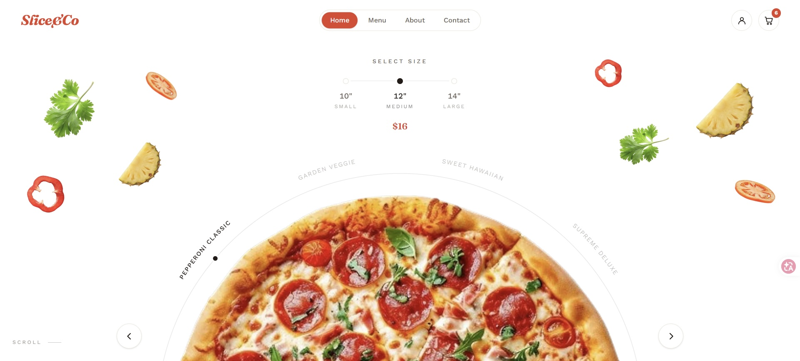

<div align="center">

# Slice&Co

**A wood-fired pizza and street-food counter, served as a React website.**

A multi-page restaurant site with a photo-driven hero slider, a 39-item menu, an item builder for every dish and a persistent cart. Built with React 19, Vite and Tailwind CSS v4.


</div>



## Demo

<!-- Add your GIF at docs/demo.gif and it will show up here. -->


## Highlights

### Hero pizza slider

The home page opens on half a pizza rising from the bottom of the screen.

- **Swap animation**: pressing `<` or `>` sinks the current pie out of view while the next one rises up from below. The two cross midway, over 500 ms with `cubic-bezier(.4, 0, .2, 1)` easing.
- **Name ring**: the four pizza names sit on an arc above the pie, and a marker moves along it to the active one.
- **Size picker**: 10", 12" and 14". The price updates as you pick, and the pie itself grows or shrinks slightly.
- **Floating ingredients**: basil, pepper, tomato and pineapple drift slowly around the hero.

### The full menu

39 items across 8 categories: **Pizza, Burgers, Fried, Falafel & Wraps, Cold Plates, Sides, Drinks and Sweets**. Every item has its own photo, price, calorie count and prep time, and a short description.

### Item builder

Each item has a detail page with options that fit its category. A pizza offers size, crust (Classic, Roman thin or Stuffed) and extras such as nduja or chilli honey. Other categories get their own options. The total price updates live as you choose.

### Cart

You can add items with their chosen options, change quantities or remove them, and see the subtotal. The cart is saved in `localStorage`, so it survives a page reload.

### Reviews

Each review names the dish it praises, links to that dish's page and takes on its category's color.

## How the slide transition works

Animating an element in from off-screen has a known pitfall. If the element already has a CSS `transition`, moving it to the off-screen start position gets animated too. The next class change then interrupts that move halfway, and the entrance barely travels at all.

`PizzaSlider.jsx` avoids this in four steps:

1. The incoming slide gets `no-transition` and `enter-below` together. Reading `el.offsetWidth` forces a reflow, so the off-screen position is committed instantly.
2. Two nested `requestAnimationFrame` calls wait until that position has been painted.
3. The code then removes `no-transition` and adds `active`, so the entrance plays its full distance.
4. At the same moment the outgoing slide gets `leave-down`. A `busy` flag ignores clicks until `transitionend` fires, and a timeout covers the case where it never does.

## Tech stack

| Tool | Purpose |
| --- | --- |
| [React 19](https://react.dev) | UI with function components and hooks |
| [Vite](https://vite.dev) | Dev server and production build |
| [Tailwind CSS v4](https://tailwindcss.com) | Utility styling via `@tailwindcss/vite` |
| [React Router 7](https://reactrouter.com) | Client-side routing |
| [oxlint](https://oxc.rs) | Linting |

## Getting started

You need [Node.js](https://nodejs.org) 20 or newer.

```bash
git clone https://github.com/amir-gilani/slice-and-co.git
cd slice-and-co
npm install
npm run dev
```

Then open [http://localhost:5173](http://localhost:5173).

| Command | What it does |
| --- | --- |
| `npm run dev` | Start the dev server with hot reload |
| `npm run build` | Build for production into `dist/` |
| `npm run preview` | Serve the production build locally |
| `npm run lint` | Lint the project with oxlint |

## Pages

| Route | Page |
| --- | --- |
| `/` | Home: hero slider, categories, featured items, reviews |
| `/menu` | Full menu, grouped by category |
| `/menu/:id` | Item detail and builder |
| `/cart` | Cart and order summary |
| `/about` | About the restaurant |
| `/contact` | Contact details |
| `*` | 404 page |

## Project structure

```
src/
├── main.jsx            # entry point
├── App.jsx             # routes
├── data.js             # menu, categories, builder options, reviews
├── cart.jsx            # cart context and actions
├── cart-store.js       # cart persistence (localStorage)
├── index.css           # Tailwind import, design tokens, custom CSS
├── assets/             # food photography (.webp)
├── components/         # Nav, Footer, PizzaSlider, Pizza, ItemCard, Reviews, ...
└── pages/              # Home, Menu, ItemDetail, Cart, About, Contact, NotFound
```

## Design

| Token | Value | Used for |
| --- | --- | --- |
| `--accent` | `#e0432c` | Logo, buttons, prices, highlights |
| `--ink` | `#241b17` | Main text |
| `--ink-soft` | `#6b5f56` | Secondary text |
| `--line` | `#ece6dc` | Borders and dividers |
| `--bg` | `#ffffff` | Page background |

Headings use [Fraunces](https://fonts.google.com/specimen/Fraunces) and body text uses [Work Sans](https://fonts.google.com/specimen/Work+Sans). All motion respects `prefers-reduced-motion`.

## Author

**Amir Hossein Barzegar**, [@amir-gilani](https://github.com/amir-gilani)
